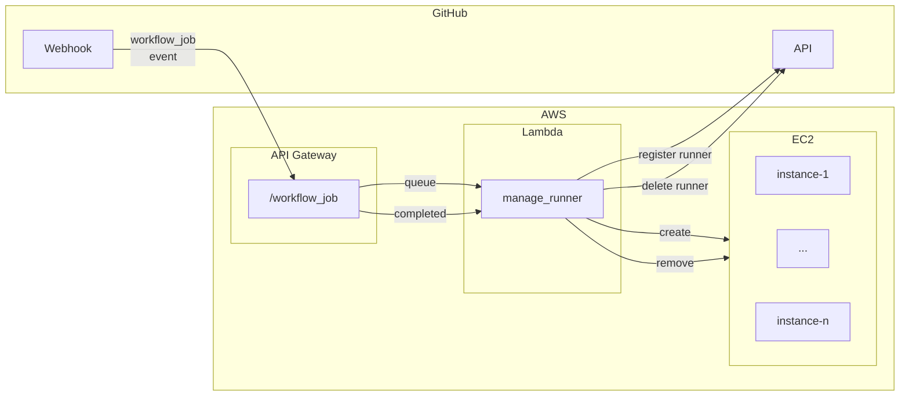

# GitHub Actions Self-Hosted Runners

## Solution
My approach to the solution is to create the following architecture:

This architecture offers ephemeral virtual machines (EC2) on-demand whenever a worflow asks for a new self-hosted runner and deletes the VM right after the workflow ends.

The benefits of using VMs include allowing detailed configuration, fully isolated environment or dedicated resources. Also they offer a clean workspace in each execution because the VMs are discarted after every use.

I choose using ephemeral virtual machines as self-hosted runners approach because it aligns quite closely with the usual behaviour of GitHub Actions and the use of GitHub-hosted runners.

Since it's going to be a feature used by the entire company, seems logical to be implemented at GitHub's organization level.

To achieve it, we need the following resources.

### GitHub
1. Define a webhook that will notify when a runner is requested or when workflow finished using it. A secret is defined to validate the received messages.
2. Organization token to allow communicate with the GitHub's API, in order to register or delete a self-hosted runner.

### AWS
1. An API Gateway, that will be the target of the GitHub's webhook. With the endpoint `/workflow_job`, it will trigger the lambda function.
2. A Lambda function that will be in charge of manage the creation and deletion of the EC2 and registering or deleting in GitHub organization through the GitHub's API. Moreover, the lambda will first validate the request has come from GitHub checking the security header `X-Hub-Signature-256`.
3. A Secret in AWS Secret Manager to store the secret value created in the GitHub Webhook, and being accesible by the Lambda Function.
4. A customized AMI including all the necesary software as well as the GitHub runner application. This AMI should be frequently maintained in order to keep all software updated.

## Deploy the solution
I would create a github repository containing the Terraform resources and a workflow for update and deploy the solution.

The workflow executes a terraform plan when a PR is opened that allow to review the changes and confirm the PR is OK. When the PR merges to main brach, a new plan is launched for the integrated code and a manual confirmation that allow to review the changes again and if everything is correct, accept it to apply the changes.

Sensitive values like the GitHub token will be stored in the GitHub secrets and passed to the Terraform as enviroment variables in the workflow.

The authentication of the workflow with AWS will be carry out via OIDC, that requieres a previous configuration.